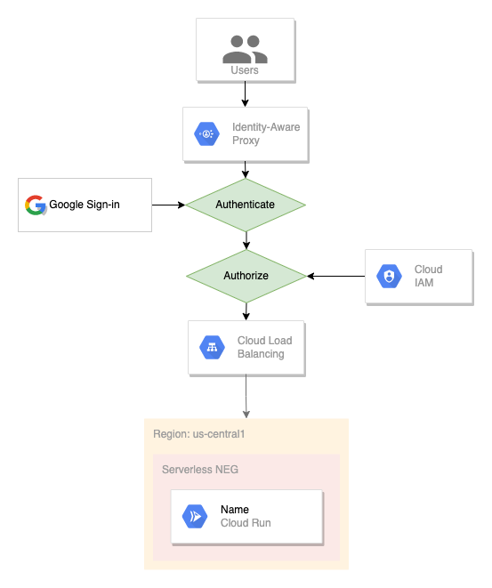

# Déployer et accéder au service Cloud Run authentifié

 Dans cette documentation, je vais detailler l'accès authentifié à Cloud Run à l'aide d'IAP (Identity-Aware Proxy: [Documentation](https://cloud.google.com/iap/docs). IAP est un service orienté Web GCP qui intercepte les requêtes envoyées à une application pour vérifier l'authentification du navigateur sur la base de cookies. Cela garantit que seuls les utilisateurs authentifiés accèdent à l'application.
 
 Pour mettre en œuvre cette documentation, vous aurez besoin de ces rôles: Cloud Run admin , IAP Secured Web app user, Cloud run invoker, IAP policy admin , IAP settings admin , Compute load balancer admin.

## Etape 1: Creation d'un service Cloud Run

 Cloud Run posséde différents types d'entrée :

**Internal** : cela autorise les requêtes provenant de l'équilibreur de charge interne, y compris les requêtes provenant de réseaux VPC partagés lorsqu'elles sont acheminées via l'équilibreur de charge HTTP(S) interne.

Ressources autorisées par tout périmètre VPC Service Controls contenant votre service Cloud Run.

Réseaux VPC qui se trouvent dans le même projet ou périmètre VPC Service Controls que votre service Cloud Run.

Les produits Google Cloud suivants, s'ils se trouvent dans le même projet ou périmètre VPC Service Controls que votre service Cloud Run : Eventarc, Pub/Sub et Workflows.

**Internal and Cloud Load Balancing** : autorise les requêtes provenant de ressources autorisées par le paramètre interne plus restrictif.

Autorise les requêtes de l'équilibreur de charge HTTP(S) externe.

**All** : les moins restrictifs. Autorise toutes les requêtes, y compris les requêtes provenant directement d'Internet, à accéder à l'URL de l'application.

## Étape 2 : Créer une adresse IP statique pour l'équilibreur de charge HTTP(S)

Il est recommandé d'utiliser une adresse IP statique lors de la création d'un équilibreur de charge plutôt que d'utiliser une adresse IP éphémère. L'adresse IP statique attribuée à l'équilibreur de charge ne change pas, fournissant un point d'entrée fixe pour votre équilibreur de charge. Lorsqu'une adresse IP statique est utilisée pour créer un frontal dans l'équilibreur de charge HTTP(S), la même adresse IP peut être réutilisée si le frontal est supprimé ou si l'équilibreur de charge est recréé. Si une adresse IP éphémère est utilisée, nous devrons mettre à jour le registre DNS qui chaque fois que le frontal est supprimé.

Pour créer une adresse IP de recherche IP statique dans GCP ou accédez à Réseau VPC et cliquez sur Adresse IP. Cliquez ensuite sur réserver une adresse statique externe.

## Étape 3 : Créer un Load Balancer HTTP(S) Classic

Un Load Balancer est un service qui relève des services réseau. L'utilisation de base d'un équilibreur de charge consiste à répartir le trafic entrant entre différents bakcends (il peut s'agir de serveurs ou de backends sans serveur). GCP, il existe [différents types de Load Balancer](https://medium.com/google-cloud/choosing-the-right-load-balancer-9ec909148a85) fournis par GCP. Dans ce cas d'utilisation, un Load Balancer classic HTTP(S) est utilisé.

Nous devrons configurer le front-end, le backend et un hôte et un chemin.

Commençons la configuration du backend de Load Balancer. Dans ce cas d'utilisation, nous avons un servless backend  qui serait une instance Cloud Run.

En ce qui concerne la configuration frontale, il est conseillé de toujours utiliser le protocole HTTPS, mais pour ce protocole, il y a peu de prérequis.

Meilleure pratique pour utiliser une adresse IP statique (mise en œuvre à l'étape 2)
Certificat SSL
Le certificat SSL peut être téléchargé ou il est également possible d'utiliser des certificats gérés par Google. J'ai utilisé des certificats gérés par Google pour créer un certificat SSL pour mon adresse IP. Il faut environ 10 à 20 minutes pour provisionner un certificat géré par Google.

## Étape 4 : Configuration de l'écran d'autorisation OAuth

[Documentation](https://developers.google.com/workspace/guides/configure-oauth-consent)

## Étape 5 : Activer IAP

Lorsqu'IAP est activé, il crée des informations d'identification dans l'API et les services. Ces informations d'identification ont un URI de redirection. Ainsi, lorsqu'un utilisateur accède au nom de domaine/IP du Load Balancer, le user est redirigé vers une page d'ouverture de connexion, il doit utiliser l'identifiant de GCP et connecter à la page. Une fois cela fait, GCP vérifie si les utilisateurs qui se sont connectés disposent de l'autorisation IAM appropriée pour accéder à cette application particulière. Si l'utilisateur dispose des rôles appropriés, la demande est envoyée à Load Balancer, puis au backend Cloud Run.

